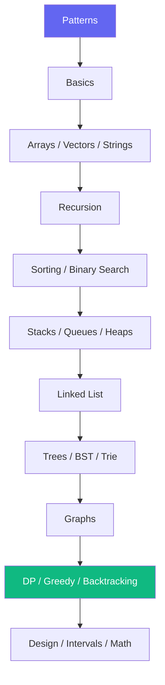

<div align="center">

# DSA — Data Structures & Algorithms

**332 C++ solutions** · LeetCode-tagged · FAANG interview prep · har topic ka README

[](./)
[](./)
[](https://github.com/subhm2004/DSA-CP)

[← Root README](../README.md) · [Browse on site](https://subhm2004.github.io/DSA-CP/) · [CP library →](../CP/)

</div>

---

## Overview

Interview-focused C++ library — clean solutions, header comments, aur har folder mein **file list + LeetCode # + TODO**.

| | |
|---|---|
| **Total files** | 332 `.cpp` |
| **Topics** | 30 folders |
| **Style** | `Solution` class · `LEETCODE : N — Title` headers |
| **Best for** | LeetCode · FAANG · college DSA · campus placements |

> Har folder ke andar [`README.md`](./arrays/README.md) — open karo, saari files ek table mein milengi.

---

## Recommended learning order



| Step | Folder | Files | Kyon |
|------|--------|------:|------|
| 0 | [Patterns](./patterns/) | 14 | Nested loops — [Thita Sheet](https://docs.google.com/spreadsheets/u/0/d/1EEYzyD_483B-7CmWxsJB_zycdv4Y5dxnzcoEQtaIfuk/htmlview) |
| 1 | [Basics](./basics/) | 16 | Loops, I/O, functions |
| 2 | [Arrays](./arrays/) · [Vectors](./vectors/) · [Strings](./strings/) | 32 · 5 · 8 | Core interview topic |
| 3 | [Recursion](./recursion/) | 35 | Subsets, permutations, base cases |
| 4 | [Sorting](./sorting/) · [Binary search](./binary_search/) | 12 · 19 | BS on answer, rotated array |
| 5 | [Stacks](./stacks/) · [Queues](./queues/) · [Heaps](./heaps/) | 22 · 11 · 15 | Monotonic stack, two heaps |
| 6 | [Linked list](./linked_list/) | 14 | Cycle (Floyd), reversal, k-group |
| 7 | [Trees](./trees/) · [BST](./bst/) · [Trie](./trie/) | 21 · 12 · 2 | Traversals, validate BST |
| 8 | [Graphs](./graphs/) | 16 | BFS, DFS, islands, topo |
| 9 | [DP](./dynamic_programming/) · [Greedy](./greedy/) · [Backtracking](./backtracking/) | 14 · 6 · 9 | Knapsack, N-Queens, Sudoku |
| 10 | [Design](./design/) · [Intervals](./intervals/) · [Math](./math/) | 1 · 3 · 10 | LRU pattern, GCD, sieve |

---

## All topics — quick index

### Core interview (high frequency)

| Topic | Files | Highlights | README |
|-------|------:|--------------|--------|
| [Arrays](./arrays/) | 32 | Two sum, rotate, product except self | [→](./arrays/README.md) |
| [Hash map](./hash_map/) | 6 | Frequency, anagram grouping | [→](./hash_map/README.md) |
| [Two pointers](./two_pointers/) | 5 | 3Sum, container with water | [→](./two_pointers/README.md) |
| [Sliding window](./sliding_window/) | 5 | Longest substring, min window | [→](./sliding_window/README.md) |
| [Binary search](./binary_search/) | 19 | Rotated array, BS on answer | [→](./binary_search/README.md) |
| [Stacks](./stacks/) | 22 | Histogram, valid parentheses, celebrity | [→](./stacks/README.md) |
| [Heaps](./heaps/) | 15 | Kth largest, median stream | [→](./heaps/README.md) |
| [Linked list](./linked_list/) | 14 | Cycle I/II, reverse, k-group | [→](./linked_list/README.md) |
| [Trees](./trees/) | 21 | LCA, diameter, level order | [→](./trees/README.md) |
| [Graphs](./graphs/) | 16 | Islands, rotten oranges, topo | [→](./graphs/README.md) |
| [Dynamic programming](./dynamic_programming/) | 14 | Knapsack, LCS, coin change | [→](./dynamic_programming/README.md) |
| [Backtracking](./backtracking/) | 9 | N-Queens, Sudoku, subsets | [→](./backtracking/README.md) |

### Data structures & patterns

| Topic | Files | README |
|-------|------:|--------|
| [Queues](./queues/) | 11 | [→](./queues/README.md) |
| [BST](./bst/) | 12 | [→](./bst/README.md) |
| [Trie](./trie/) | 2 | [→](./trie/README.md) |
| [Sorting](./sorting/) | 12 | [→](./sorting/README.md) |
| [Greedy](./greedy/) | 6 | [→](./greedy/README.md) |
| [Recursion](./recursion/) | 35 | [→](./recursion/README.md) |
| [Bit manipulation](./bit_manipulation/) | 4 | [→](./bit_manipulation/README.md) |
| [Intervals](./intervals/) | 3 | [→](./intervals/README.md) |
| [Design](./design/) | 1 | [→](./design/README.md) |

### Foundations & extras

| Topic | Files | README |
|-------|------:|--------|
| [Patterns](./patterns/) | 14 | [→](./patterns/README.md) |
| [Basics](./basics/) | 16 | [→](./basics/README.md) |
| [Strings](./strings/) | 8 | [→](./strings/README.md) |
| [Vectors](./vectors/) | 5 | [→](./vectors/README.md) |
| [Char array](./char_array/) | 2 | [→](./char_array/README.md) |
| [OOP](./oop/) | 10 | [→](./oop/README.md) |
| [Math](./math/) | 10 | [→](./math/README.md) |
| [Miscellaneous](./miscellaneous/) | 1 | Josephus · [→](./miscellaneous/README.md) |
| [Misc](./misc/) | 2 | [→](./misc/README.md) |

---

## Featured solutions

| Problem | File | LC |
|---------|------|-----|
| Number of Islands | [`graphs/number_of_islands.cpp`](./graphs/number_of_islands.cpp) | 200 |
| Linked List Cycle II | [`linked_list/tortoise_algo.cpp`](./linked_list/tortoise_algo.cpp) | 141 / 142 |
| N-Queens | [`backtracking/`](./backtracking/) | 51 |
| Reverse Linked List | [`linked_list/reverse_linked_list.cpp`](./linked_list/reverse_linked_list.cpp) | 206 |
| Kth Largest in Stream | [`heaps/`](./heaps/) | 703 |
| Course Schedule (topo) | [`graphs/topological_sort_kahn.cpp`](./graphs/topological_sort_kahn.cpp) | 207 |
| LRU Cache pattern | [`design/`](./design/) · [`doubly_linked_list.cpp`](./linked_list/doubly_linked_list.cpp) | 146 |

Har file ka exact LeetCode tag → us folder ka README dekho.

---

## FAANG coverage

| Category | Topics | Status |
|----------|--------|--------|
| **Array / string tricks** | Two pointers, sliding window, hash | ✅ |
| **Linear DS** | Stack, queue, heap, linked list | ✅ |
| **Trees** | Binary tree, BST, trie | ✅ |
| **Graphs** | BFS, DFS, flood fill, DSU, topo | ✅ |
| **DP / greedy** | 1D/2D DP, interval, greedy choice | ✅ |
| **Backtracking** | Subsets, permutations, board problems | ✅ |
| **Math / bit** | GCD, sieve, XOR tricks | ✅ |
| **Design** | LRU-style doubly linked list | 🟡 (expand) |
| **Intervals** | Merge, insert | 🟡 (expand) |

---

## File header format

```cpp
/*
 * TOPIC    : Linked List — Floyd cycle
 * FILE     : tortoise_algo.cpp
 * PROBLEM  : Detect cycle + find cycle entry
 * LEETCODE : 141 — Linked List Cycle / 142 — Cycle II
 * APPROACH : Slow (1 step) + fast (2 steps); reset slow to head
 * COMPLEX  : Time O(n)  |  Space O(1)
 */
```

Site search (`generate_site_data.py`) in headers se LeetCode tags parse karta hai.

---

## Compile & run

```bash
# Single file
g++ -std=c++17 -O2 DSA/graphs/number_of_islands.cpp -o sol && ./sol

# With debug input (agar file mein #ifdef LOCAL ho)
g++ -std=c++17 -O2 -DLOCAL DSA/path/file.cpp -o sol && ./sol
```

**macOS tip:** Default `clang++` chalega most DSA files ke liye. PBDS wale solutions → [`../CP/data_structures/`](../CP/data_structures/) (GNU g++ chahiye).

---

## DSA vs CP (is repo mein)

| | **DSA/** (yahan) | **[CP/](../CP/)** |
|---|------------------|---------------------|
| Focus | Interview clarity | Contest speed |
| Graphs | BFS, DFS, islands | Dijkstra, flows, HLD |
| Code | `Solution` + comments | Templates, structs, fast I/O |
| When | LeetCode / FAANG | Codeforces / ICPC |

Contest ke liye: [`../CP_Template/cp_template.cpp`](../CP_Template/cp_template.cpp) copy karo.

---

## Maintenance

Nayi file add karne ke baad:

```bash
python3 scripts/generate_folder_readmes.py   # is folder ka README update
python3 scripts/generate_site_data.py        # site index update
```

---

## External resources

- [Thita Patterns Sheet](https://docs.google.com/spreadsheets/u/0/d/1EEYzyD_483B-7CmWxsJB_zycdv4Y5dxnzcoEQtaIfuk/htmlview) — pattern practice
- [LeetCode](https://leetcode.com/) — problem practice
- [NeetCode roadmap](https://neetcode.io/roadmap) — topic order reference

<div align="center">

**[← Back to repo root](../README.md)** · **[Live site →](https://subhm2004.github.io/DSA-CP/)**

</div>
